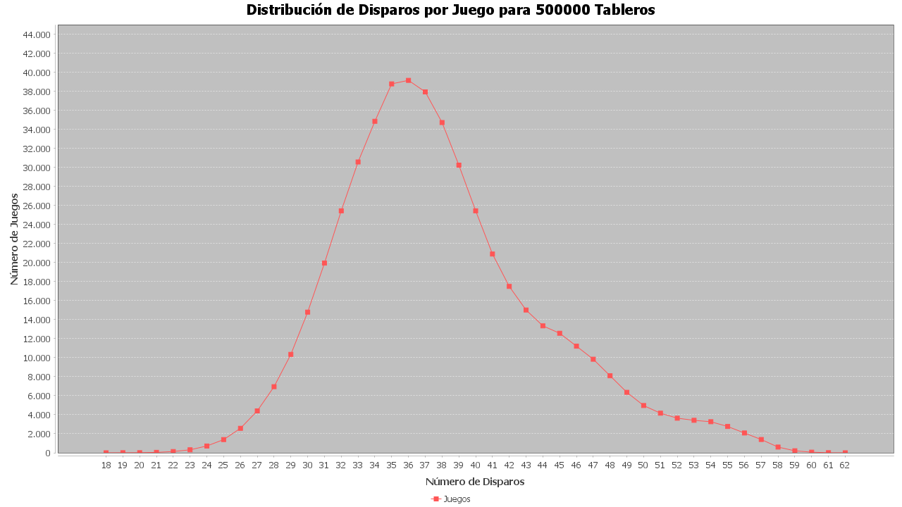

# JDK Utilizado

JDK: 24

Compilación


```

javac --release 24 -g:none -d bin -cp src src/problema/*.java src/solucion/*.java src/solucion/enumerados/*.java src/solucion/mapa/*.java

```


Ejecución

```

java -Xms1024m -Xmx1024m -cp bin solucion.App

```

# Nota

  ✅ El objetivo principal de la tarea es resolver en menos de 50 tiros (cumplido).

 ✅ También me quiero enfocar en resolver los 500 000 tableros en menos de 1 segundo sin importar el tipo de optimización que conlleve.
 
 - Próximo: Reducir el tiempo a menos de 0,1 segundos.

En mapa oceano se puede reducir el tiempo en 0,3 segundos al eliminar el siguiente fragmento de código, con el inconveniente de que empeora el promedio de disparos, aumentando a 39.

```Java
int cambio = (direccion == Direccion.DERECHA || direccion == Direccion.ABAJO) ? 1 : -1;
  for (int i = 0; i < barco.getLargo(); i++) {
      int nuevoValor = valorEje + (i * cambio);
      char valor;
      if (direccionHorizontal) {
          valor = mapa[coordenada.getFila()][nuevoValor];
      } else {
          valor = mapa[nuevoValor][coordenada.getColumna()];
      }
      if (valor != DESCONOCIDO) {
          return false;
      }
  }
```

 
 ❕ Adicionalmente me quiero enfocar en investigar formas de seguir reduciendo el promedio. 


**Resumen para 500 000 tableros en i5-14600k**

Intentos: 18789144

Intentos promedio: 37,5783

Tiempo resolviendo: 0,745 segundos




# Enunciado
PROYECTO:
Asunto:
[ADA] Proyecto 1

Battleship es un juego donde hay barcos ubicados en una grilla bidimensional (oceano). El oceano es de dimensión 10x10, y 
existen 5 barcos ubicados ahí. 
Los barcos pueden ubicarse sólo en vertical u horizontal (no en diagonal), y cada barco no puede solaparse con el contrario. La lista de barcos es:
- PortaAviones (A), que usa 5 casillas.
- Buque (B), que usa 4 casillas.
- Submarino (S) y Cruzero (C), que usan 3 casillas cada una.
- Y un Destructor (D), que usa 2 casillas.

Un ejemplo de tablero puede ser:
```
0 D 0 0 0 0 0 0 0 0
0 D 0 0 A A A A A 0
0 0 0 0 0 0 0 0 0 0
0 0 0 0 0 B 0 0 0 0
0 0 0 0 0 B 0 0 0 0
0 0 0 0 0 B 0 0 0 0
0 0 0 0 0 0 0 0 0 0
0 C C C 0 0 0 0 0 0
0 0 0 0 0 0 0 S S S
0 0 0 0 0 0 0 0 0 0
```
El oceano se encuentra escondido para usted (privado en la clase Tablero.java). Usted puede disparar al tablero, indicando las coordenadas x e y. La clase le dirá si es que este disparo dio en un barco (y cual barco) y cuando falló. El objetivo es hundir todos los barcos (Ejemplo: para hundir el Buque, se debe disparar a sus 4 posiciones), en el menor número de disparos posibles.

Usted puede sólo interactuar de la siguiente manera:
- Constructor Tablero(int n), el cual crea un tablero al azar de nxn.
- char Disparo(int x, int y), el cual dispara a una posición entre 1 y n en cada dimensión. Si el disparo es acertado, devolverá la letra identificadora del barco, si es fallido devolverá el caracter '0'. Si usted dispara a un lugar ya disparado, devolverá 'X'. Si intenta disparar a cualquier posición fuera del tablero, devolverá el char indexado con 0.
- int ganar(), que retorna 0 en caso de que aún usted no haya hundido todos los barcos. Sino, devolverá el número de veces que usted haya invocado Disparo(). Por defecto está comentado la opción de imprimir el tablero al ganar, pero tiene la libertad de descomentarlo para pruebas.

Se recomienda hacer uso de una estrategia probabilística. Como referencia puede ver el vídeo y el link a continuación:
- Vídeo: https://youtu.be/LbALFZoRrw8
- Documento: http://www.datagenetics.com/blog/december32011/

La solución probabilística del profesor promedia bajo 50 disparos. Una solución probabilística no tan inteligente promedia bajo 65 disparos. Usted debe crear un programa que reciba el número de tableros u oceanos a jugar, y entrega por pantalla la cantidad de disparos promedio necesarios para ganar en dicha cantidad de oceanos. Usted debe, por obligación, usar el archivo Tablero.java para su solución.

Bajo 50 disparos promedio sobre 500.000 oceanos se considerará un 7. De 51 a 65 disparos promedio será escala de 6,9 a 5. Bajo 65 disparos será 4 para abajo hasta 95, que es un 1.
